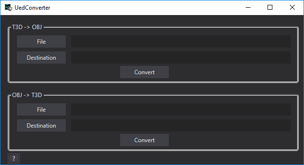

# UEdConverter

Converts t3d files (like brushes) from Unreal Engine 1.5 to obj format and vice-versa. Allows to edit Unreal's brushes in regular 3D editors.



## How to
 - Open executable
 - Choose File as file which will be converted
 - Choose Destination as file where conversion will be saved
 - Click Convert

```diff
-!Conversion may brake some models. Overriding files is inadvisable!
```
