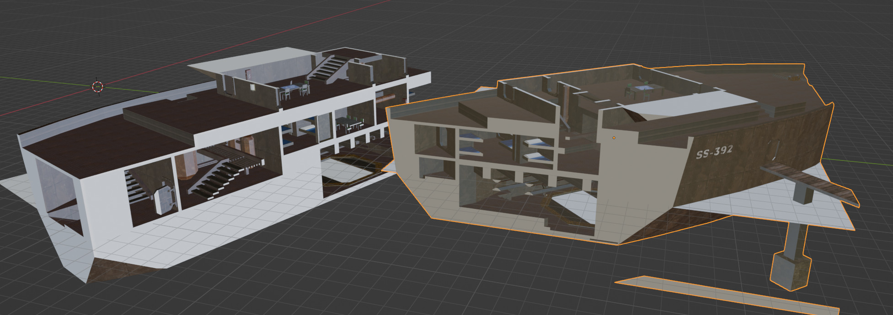
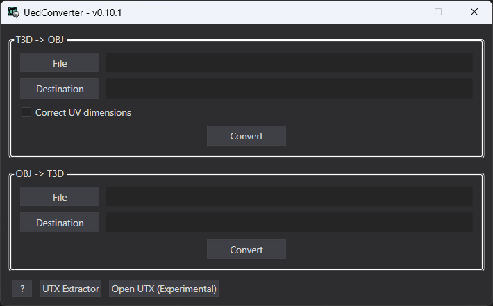
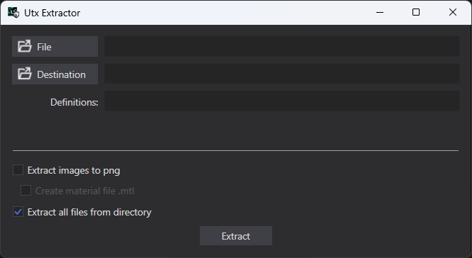
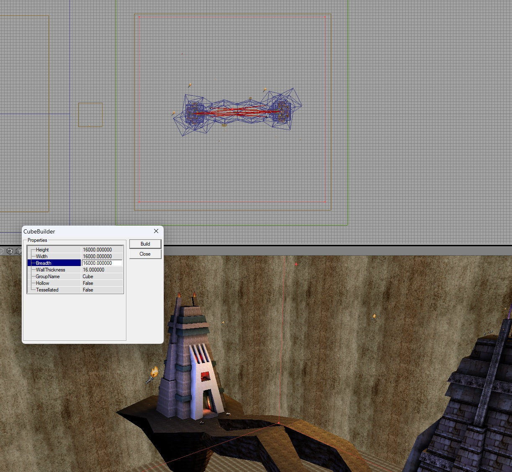
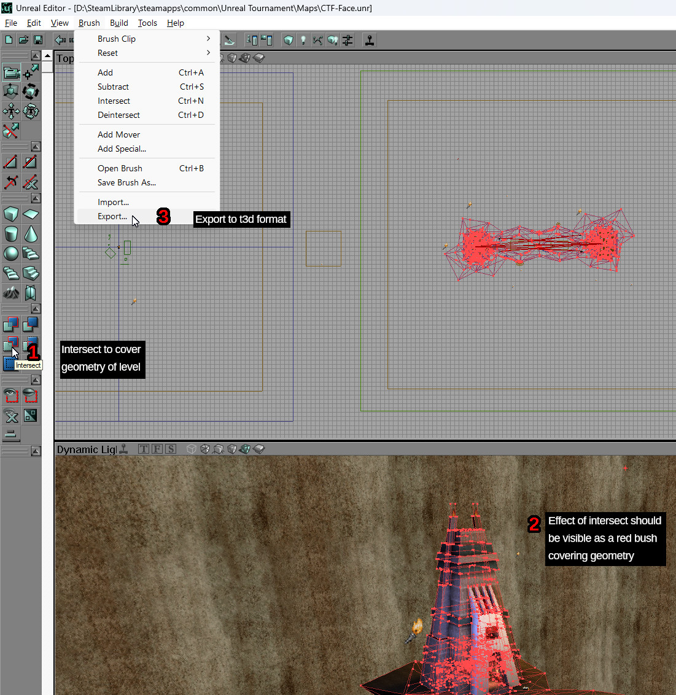
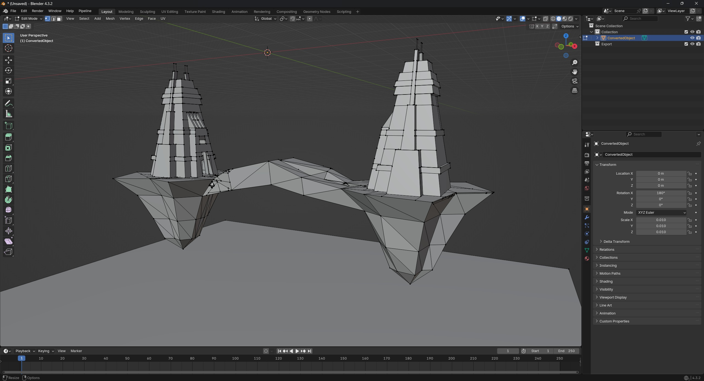
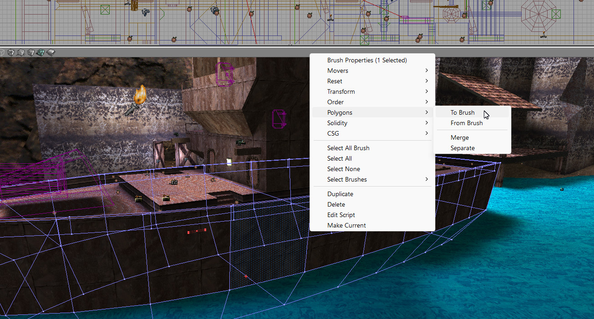

# UEdConverter

1. [Description](#description)
2. [File Convertion](#converting-brush)
3. [Texture support](#texture-support) 
4. [How to export geometry from UnrealEd](#how-to-export-geometry-from-unrealed)
   1. [Cutting piece of map geometry](#cutting-piece-of-map-geometry)
   2. [Exporting single brush](#exporting-single-brush)
---



## Description
Converts t3d brush files from Unreal Engine 1.5 to obj format and vice-versa. Allows to edit Unreal's brushes in regular 3D editors.
There is acually 3 functionalities as all of them are usefull while moving files between Blender and UnrealEd.
- Converter between `.obj` and `.t3d` files
- Utx extractor
- Utx viewer (This is used only for development of other features)

### What it does:
- It converts UEd brushes
- Both polygons and UV coordinates are preserved
- Converter applies axis changes to match Blender importer, so by default you don't need to change importer settings
- Can convert with taxtures applied when converting from Unreal brush to OBJ
### What it doesn't:
- No support for texturing when converting to Unreal's brush
- Program does not support map export/import as UEd uses CSG (boolean operations to create geometry) and those are not precomputed in such file.

---




## Converting brush
 - Open executable
 - Click "File" and select source for conversion
 - Click "Destination" and select destination file for conversion
 - Click Convert

## Texture support
Partial texture support is provided. If file `texture_dict.txt` is provided, the textures will have correct scale and if materials also provided, textures can be imported inside a 3D program.

### How to do it:
   

1. Extract texture data and images (tick all checkboxes).
2. Place `texture_dict.txt` in same directory as exe.
4. Convert (`T3D->OBJ`) file with `Correct UV dimensions` checked.
3. Make sure obj file you converted is in the same directory as `materials.mtl` and `ExtractedImages` that was created during extraction.
5. Import obj in the 3d program.

### Example file `texture_dict.txt`:
```
Lantern2 64x64
pmbLight3 64x64
pmbLight3or 64x64
pmbfloor-E 128x128
```

### Troubleshooting:
- Material file (.mtl) contains relative paths to the textures. If you move files without replacing paths inside material file, textures won't be imported.
- Sometimes not all textures can be recognized, make sure that during export all needed files were exported. Exporter overwrites files and doesn't append new textures to `texture_dict.txt` or `materials.mtl` you have to do it manually.
- Procedural textures are not supported by converter and exporter, those will become blank inside 3d programs.
- Some textures may have same name as other textures, this is limitation from Unreal(exported brush does not point to specific file but only contains name of texture), if this is a problem you need to modify `texture_dict.txt` and/or `materials.mtl`. In `texture_dict.txt` first texture will be saved normally but duplicates that have different dimensions of image will be saved like this `"<Filename>.<TextureName> <Width>x<Height>"`.


## How to export geometry from UnrealEd:
Since only brushes have calculated geometry the most important option can be found in Brush->Export inside UnrealEd.
There are two ways to get geometry: exporting single brush(might be usefull for Movers(purple brushes)) or by creating brush that will encapsulate all geometry you wish to export and intersecting brush with calculated geometry. Below both methods are shown step by step:

```
!! Make sure that brush inside UnrealEd have correct scaling and rotation(reset them if possible) !!
!! otherwise you may achive unwanted results !!
to do this click on brush and in brush menu you can perform resets
```

### Cutting piece of map geometry

1. In editor create brush (right click on shape toolbox to select size) in shape and size you wish, and position it on level geometry you are interested in.



2. Select intersect option(1) and then export brush(3)



4. Convert Files
5. Import into 3d program



### Exporting single brush

1. Select brush(on picture blue mesh), right-click and select "Polygons->To Brush"
2. Export as in prevoius example




